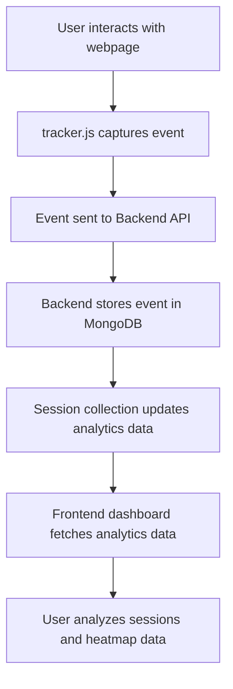

# User Analytics Application

A full-stack analytics dashboard built as part of the Full Stack Engineer assignment for CausalFunnel.

The application tracks user interactions on a webpage, stores analytics events, and provides a dashboard to visualize user sessions, event journeys, and click behavior through heatmap visualization.

---

## Project Overview

This application simulates a lightweight user analytics system similar to modern product analytics platforms.

It captures user activity on a webpage using a custom tracking script and provides a dashboard to analyze user behavior.

Tracked events include:

* Page Views
* Click Events

Each event is associated with a unique session and stored in MongoDB for analytics processing.

---

## Features

### Event Tracking SDK

A custom JavaScript tracker script captures user interactions from a webpage.

Tracks:

* Page View Events
* Click Events

Each event stores:

* sessionId
* eventType
* pageUrl
* timestamp
* click coordinates (for click events)

---

### Session Analytics Dashboard

Displays all tracked sessions.

Each session shows:

* Unique Session ID
* Total Events
* Pages Visited
* Last Activity Timestamp

---

### Session Journey Analytics

Detailed session-level event tracking.

Features:

* Chronological event timeline
* Event filtering

Filters:

* All Events
* Click Events
* Page View Events

Additional functionality:

* Pagination support for large event lists

---

### Heatmap Visualization

Visualizes click activity for individual pages.

Features:

* Page selection dropdown
* Click distribution visualization
* Dynamic click rendering using recorded x/y coordinates

---

## Tech Stack

### Frontend

* React.js
* TypeScript
* Vite
* Tailwind CSS v4
* Axios
* React Router DOM

### Backend

* Node.js
* Express.js
* JavaScript (ES Modules)

### Database

* MongoDB
* Mongoose

---

## Architecture

System flow:




---

## API Endpoints

### Track Analytics Event

```http
POST /api/track
```

Request body:

```json
{
  "sessionId": "abc123",
  "eventType": "click",
  "pageUrl": "http://localhost:5500/demo/index.html",
  "timestamp": "2026-06-18T10:30:00Z",
  "clickData": {
    "x": 250,
    "y": 380
  }
}
```

---

### Get All Sessions

```http
GET /api/sessions
```

Returns:

* All tracked sessions
* Total event count per session

---

### Get Session Events

```http
GET /api/sessions/:sessionId
```

Returns:

* Ordered session event timeline

---

### Get Heatmap Click Data

```http
GET /api/heatmap?page=<page-url>
```

Returns:

* Click coordinate data for selected page

---

## Setup Instructions

### Clone Repository

```bash
git clone https://github.com/Saumyaketu/Analytics-App.git
```

---

### Backend Setup

```bash
cd backend
npm install
```

Create .env file

```env
PORT=5000
MONGO_URI=your_mongodb_connection_string
FRONTEND_URL=http://localhost:5173
```

Run backend

```bash
npm run dev
```

---

### Frontend Setup

```bash
cd frontend
npm install
```

Create .env file

```env
VITE_API_URL=http://localhost:5000/api
```

Run frontend

```bash
npm run dev
```

---

### Demo Page Setup

Serve demo page locally.

Example using Live Server extension in VS Code.

Ensure tracker.js script is connected.

---

## Tracker Integration

The project includes a custom tracking SDK.

Tracker responsibilities:

* Generate persistent session ID using localStorage
* Track page view events
* Track click events
* Send analytics events to backend API

Example initialization flow:

```text
Page Load → Track Page View

User Click → Track Click Event

Send Event → Backend API
```

---

## Assumptions / Trade-offs

### Assumptions

* Each browser stores a persistent sessionId using localStorage
* All page URLs are captured using absolute URLs via window.location.href

### Trade-offs

* Heatmap implemented using manual click visualization instead of external heatmap library
* No authentication system added since assignment focuses on analytics functionality
* UI kept intentionally minimal with focus on functionality and architecture

---

## Future Improvements

Potential improvements:

* Real heatmap visualization using external libraries
* Device and browser analytics
* Session replay functionality
* Geo-location analytics
* Authentication and multi-user dashboards
* Deployment using cloud infrastructure

---

## Assignment Status

Completed requirements:

* Event Tracking Script
* Session Analytics API
* MongoDB Storage
* Sessions Dashboard
* Session Journey Visualization
* Heatmap Click Visualization

All core assignment requirements successfully implemented.
